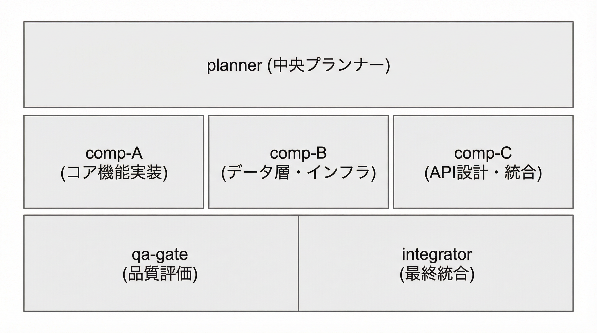

# Arena Layouts - tmuxペイン分割とレイアウト案

## tmuxの基本概念

### ウィンドウ vs ペイン

**ウィンドウ（Window）**
- タブのようなもの
- 1つずつしか表示できない
- `Ctrl+b, n` で切り替え
- **現在の `/arena` はこの方式**

**ペイン（Pane）**
- ウィンドウを分割したもの
- 複数のペインを**同時に表示**できる
- 画面を分割して並べて表示

### ペイン分割のコマンド

```bash
# 水平分割（上下に分割）
tmux split-window -h

# 垂直分割（左右に分割）
tmux split-window -v

# ペインのサイズ変更
tmux resize-pane -D 10  # 下に10行拡大
tmux resize-pane -U 10  # 上に10行拡大
tmux resize-pane -R 10  # 右に10列拡大
tmux resize-pane -L 10  # 左に10列拡大

# ペイン間の移動
Ctrl+b, ↑↓←→  # 矢印キーで移動
Ctrl+b, o      # 次のペインへ
```

---

## 現在の `/arena` の動作

### 現状：ウィンドウ方式

```
tmuxセッション "arena"
├─ ウィンドウ 0: planner     (表示)
├─ ウィンドウ 1: comp-A      (非表示)
├─ ウィンドウ 2: comp-B      (非表示)
├─ ウィンドウ 3: comp-C      (非表示)
├─ ウィンドウ 4: qa-gate     (非表示)
└─ ウィンドウ 5: integrator  (非表示)
```

**問題点**：
- 1つずつしか見れない
- 切り替えが面倒
- 全体の進捗が把握しづらい

---

## 提案レイアウト案

### レイアウト案 1: 2x3グリッド（推奨）

6つのエージェントを均等に配置。全体を一目で確認できる。


```
┌─────────────────────┬─────────────────────┬─────────────────────┐
│                     │                     │                     │
│      planner        │      comp-A         │      comp-B         │
│   (中央プランナー)    │   (コア機能実装)      │  (データ層・インフラ)  │
│                     │                     │                     │
├─────────────────────┼─────────────────────┼─────────────────────┤
│                     │                     │                     │
│      comp-C         │      qa-gate        │    integrator       │
│   (API設計・統合)     │    (品質評価)        │   (最終統合)         │
│                     │                     │                     │
└─────────────────────┴─────────────────────┴─────────────────────┘
```

**メリット**：
- 全エージェントを同時に表示
- 均等なサイズで見やすい
- 進捗を一目で把握

**デメリット**：
- 各ペインが小さめ
- 大きなモニターが推奨

---

### レイアウト案 2: Planner重視レイアウト

中央プランナーを大きく表示し、他のエージェントは小さく配置。


```
┌─────────────────────────────────────────┬─────────────────────┐
│                                         │      comp-A         │
│                                         │   (コア機能実装)      │
│                                         ├─────────────────────┤
│            planner                      │      comp-B         │
│         (中央プランナー)                   │  (データ層・インフラ)  │
│                                         ├─────────────────────┤
│                                         │      comp-C         │
│                                         │   (API設計・統合)     │
├─────────────────────────────────────────┼─────────────────────┤
│           qa-gate                       │    integrator       │
│          (品質評価)                       │   (最終統合)         │
└─────────────────────────────────────────┴─────────────────────┘
```

**メリット**：
- プランナーの出力が見やすい
- タスク分解の詳細を確認しやすい

**デメリット**：
- 競争チームの表示が小さい

---

### レイアウト案 3: 3段レイアウト

プランナー、競争チーム、QA/統合の3段構成。



```
┌───────────────────────────────────────────────────────────────┐
│                         planner                               │
│                      (中央プランナー)                            │
├─────────────────────┬─────────────────────┬─────────────────────┤
│      comp-A         │      comp-B         │      comp-C         │
│   (コア機能実装)      │  (データ層・インフラ)  │   (API設計・統合)     │
├─────────────────────┴─────────────────────┴─────────────────────┤
│           qa-gate                       │    integrator       │
│          (品質評価)                       │   (最終統合)         │
└─────────────────────────────────────────┴─────────────────────┘
```

**メリット**：
- 役割ごとに整理されている
- プランナーが見やすい
- 競争チームを並べて比較しやすい

**デメリット**：
- 縦に長くなる

---

### レイアウト案 4: 左右分割（シンプル）

プランナーと競争チームを左右に配置。


```
┌─────────────────────────────────┬─────────────────────────────────┐
│                                 │           comp-A                │
│                                 │        (コア機能実装)             │
│                                 ├─────────────────────────────────┤
│           planner               │           comp-B                │
│        (中央プランナー)            │       (データ層・インフラ)          │
│                                 ├─────────────────────────────────┤
│                                 │           comp-C                │
│                                 │        (API設計・統合)            │
├─────────────────────────────────┼─────────────────────────────────┤
│          qa-gate                │        integrator               │
│         (品質評価)                │        (最終統合)                 │
└─────────────────────────────────┴─────────────────────────────────┘
```

**メリット**：
- シンプルで分かりやすい
- プランナーと実装チームを分離

---

### レイアウト案 5: 縦1列（ノートPC向け）

小さい画面でも使いやすい縦並び。


```
┌───────────────────────────────────────────────────────────────┐
│                         planner                               │
├───────────────────────────────────────────────────────────────┤
│                         comp-A                                │
├───────────────────────────────────────────────────────────────┤
│                         comp-B                                │
├───────────────────────────────────────────────────────────────┤
│                         comp-C                                │
├───────────────────────────────────────────────────────────────┤
│                         qa-gate                               │
├───────────────────────────────────────────────────────────────┤
│                       integrator                              │
└───────────────────────────────────────────────────────────────┘
```

**メリット**：
- ノートPCでも使いやすい
- スクロールで全体を確認

**デメリット**：
- 同時に見れるのは2-3個のみ

---

## 実装方法の比較

### 方法1: arena-launcher.sh を修正

**メリット**：
- `/arena` コマンドで自動的にレイアウト作成
- 設定不要

**デメリット**：
- スクリプトが複雑になる
- レイアウト変更が面倒

### 方法2: tmuxp を使用

**メリット**：
- YAMLで簡単にレイアウト定義
- 複数のレイアウトを切り替え可能
- 再現性が高い

**デメリット**：
- tmuxpのインストールが必要
- 追加の設定ファイルが必要

### 方法3: tmuxinator を使用

**メリット**：
- Rubyベースで安定
- 豊富な機能

**デメリット**：
- Rubyのインストールが必要

---

## 推奨案

**レイアウト案 3: 3段レイアウト + tmuxp**

理由：
1. 役割ごとに整理されて見やすい
2. プランナーが上部で全体を把握しやすい
3. 競争チームを横並びで比較しやすい
4. tmuxpでレイアウトを簡単に定義・変更可能

---

## 次のステップ

1. **レイアウトを選択**してください（1〜5のいずれか）
2. **実装方法を選択**してください（arena-launcher.sh修正 or tmuxp）
3. 選択に基づいて実装します

または、カスタムレイアウトのご要望があればお聞かせください。
